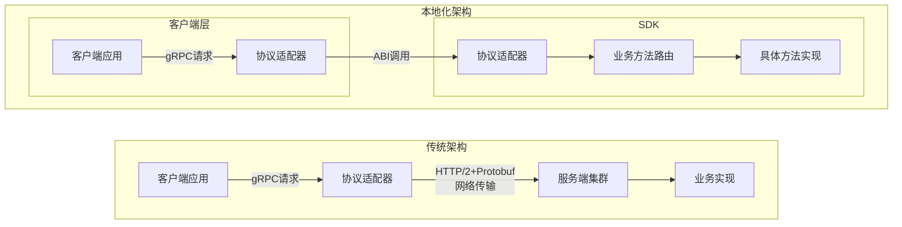
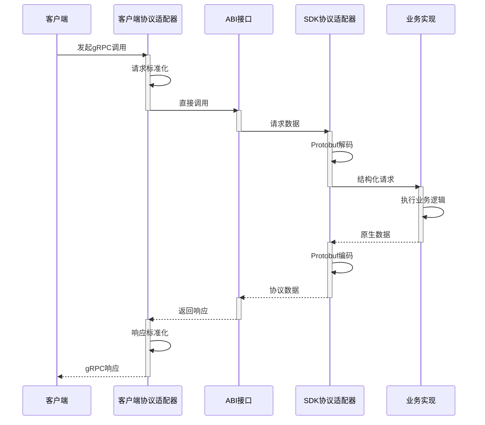
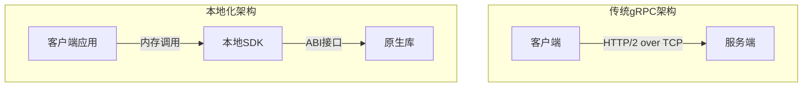
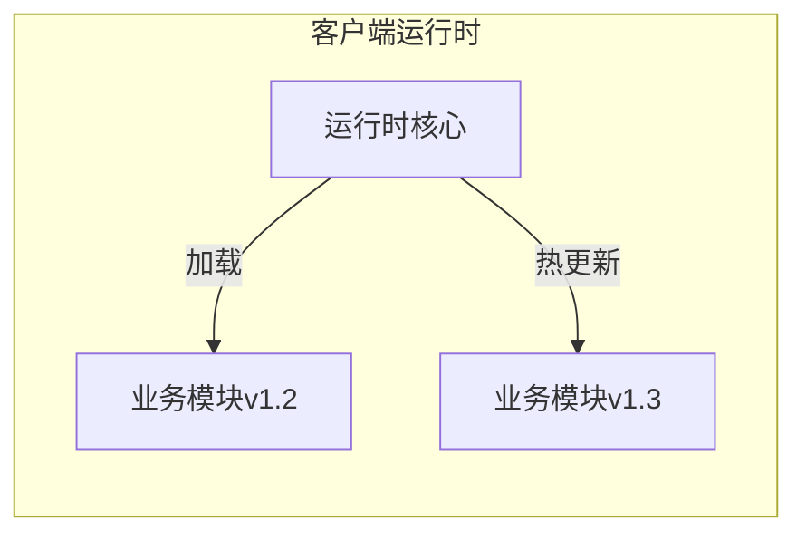
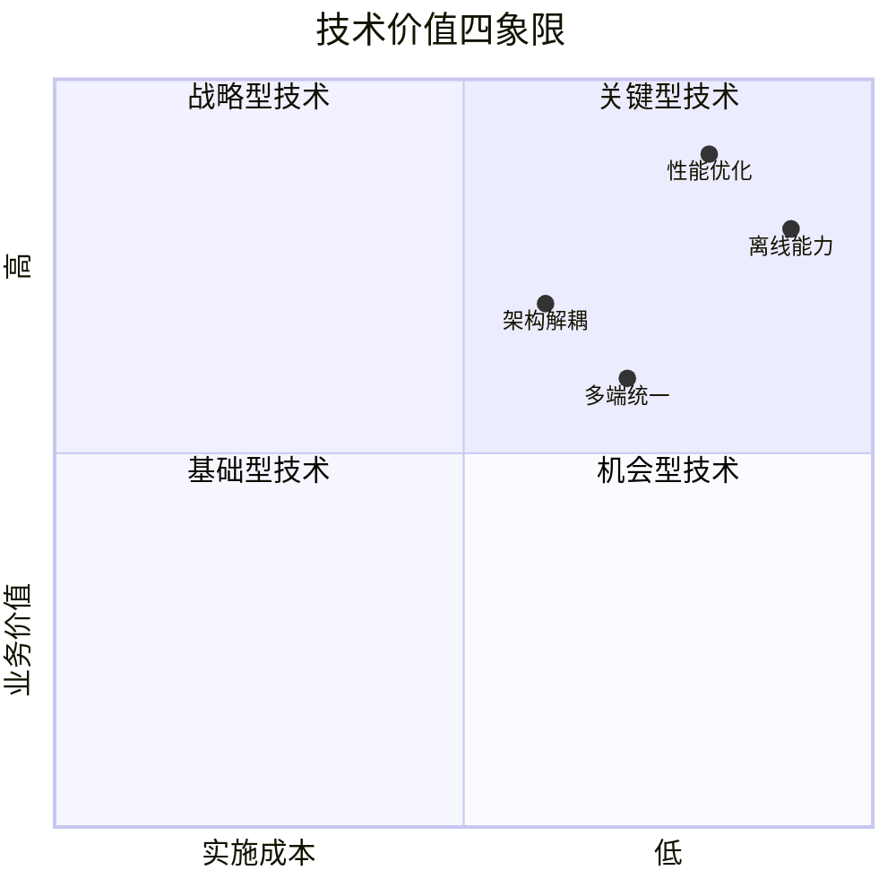

# 基于gRPC协议的云端业务本地化执行方案 - SDK实现Demo
[](https://github.com/JackieLeee/inline-grpc-sdk-go/actions)
[](https://opensource.org/licenses/Apache-2.0)

## 目录
- [背景与痛点](#背景与痛点)
- [技术方案设计](#技术方案设计)
  - [架构演进路径](#架构演进路径)
  - [核心实现原理](#核心实现原理)
- [功能特性](#功能特性)
- [核心价值](#核心价值)
- [适用场景](#适用场景)
  - [高频实时交互业务（IM/游戏指令）](#高频实时交互业务im游戏指令)
  - [弱网环境关键服务（支付/身份验证）](#弱网环境关键服务支付身份验证)
  - [边缘计算场景（IoT设备/车载系统）](#边缘计算场景IoT设备车载系统)
- [快速开始](#快速开始)
  - [环境准备](#环境准备)
  - [集成示例](#集成示例)

## 背景与痛点
传统云端服务架构依赖远程网络调用，存在以下核心瓶颈：
1. **网络延迟不可控**：跨地域通信受物理距离和网络质量限制，高频调用场景下延迟累积显著
2. **离线场景不可用**：网络中断时业务完全停滞，影响用户体验与系统可靠性
3. **服务端资源瓶颈**：海量客户端并发请求导致服务器负载过载，扩容成本指数级增长

基于gRPC等RPC框架的改进方案虽通过HTTP/2多路复用、Protobuf高效序列化等特性提升了性能，但仍未突破网络通信的物理限制。本方案创新提出**SDK化业务下沉**技术路线，将服务端业务逻辑转化为客户端本地化执行能力。

---

## 技术方案设计
### 架构演进路径

与传统架构对比，本方案采用**本地化架构**，将服务端业务逻辑转化为客户端本地化执行能力



### 核心实现原理
采用**Golang+gRPC+Protobuf**技术栈构建标准化SDK，通过三大层次重构实现质变：


#### 1. 协议层兼容性设计
- **接口继承**：完整保留gRPC的.proto接口定义、Protobuf编解码规范及错误处理机制，确保与现有系统无缝对接
- **生态复用**：通过自动代码生成工具链（protoc-gen-go）实现业务逻辑的无缝迁移，服务接口调用代码零修改

#### 2. 传输层革新原理
- **网络协议栈层级消除**：将基于HTTP/2的远程网络调用替换为进程内本地调用，规避TCP握手、HTTP/2帧封装等网络协议处理，消除网络IO开销：


#### 3. 架构层改造策略
- **业务逻辑编译**：通过LLVM工具链将Golang服务代码编译为平台原生库（Android JNI/iOS Framework/Windows DLL）
- **标准化接口暴露**：基于C ABI(Application Binary Interface)提供跨语言调用能力
- **动态加载机制**：客户端运行时通过ABI接口动态加载业务模块，实现热更新与版本控制

---
## 功能特性
- [x] 全量兼容现有gRPC/protobuf生态
- [x] 毫秒级本地方法调用延迟
- [x] 多架构ABI动态加载
- [x] 业务模块热更新能力



## 核心价值
1. **通信效率质变**：端侧执行路径缩短，延迟大幅下降，提升用户体验
2. **离线业务连续性**：关键业务逻辑脱离网络依赖，支持无网环境持续服务
3. **资源消耗优化**：降低云端计算负载，显著减少服务器成本
4. **跨平台一致性**：通过C ABI接口实现Android/iOS/Windows/Linux多端统一架构

## 适用场景
适合离线化的场景需满足 **低一致性要求** + **轻量级计算**，而需依赖中心化强管控或海量资源集中处理的这类业务则不适合

### 高频实时交互业务（IM/游戏指令）
**说明**：需毫秒级响应，依赖客户端本地计算减少网络往返。  
**适合原因**：  
• 本地缓存消息/操作记录，弱网时保障交互流畅性  
• 实时指令（如游戏技能释放）需规避网络抖动影响

### 弱网环境关键服务（支付/身份验证）
**说明**：核心服务需在网络波动时降级运行，不中断用户体验。  
**适合原因**：  
• 支付凭据/生物特征可离线加密存储与校验  
• 失败操作自动进入本地重试队列

### 边缘计算场景（IoT设备/车载系统）
**说明**：端侧设备需独立执行规则或轻量化AI推理。  
**适合原因**：  
• 减少云端依赖，降低响应延迟（如车载紧急制动）  
• 节省带宽成本（工厂传感器本地过滤无效数据）
---

## 快速开始
### 环境准备
#### 1. 工具链安装
• **Android NDK**（必备）  
下载地址：[Android NDK官方下载](https://developer.android.com/ndk)

• **CMake**（构建工具）  
下载地址：[CMake官方下载](https://cmake.org/download)

#### 2. 代码库克隆与编译
```bash
# 克隆仓库
git clone https://github.com/JackieLeee/inline-grpc-sdk-go.git
cd inline-grpc-sdk-go

# 一键编译（输出至output目录）
make
```

#### 3. 生成文件结构
```
output/
├── android_archive
│   ├── libgrpc_server.aar         # Android Archive文件
│   └── libgrpc_server-sources.jar # Java Archive文件
├── arm64-v8a
│   ├── libgrpc_server.so          # arm64-v8a架构动态库
│   └── libgrpc_server.h           # C接口定义
├── armeabi-v7a│   ├── libgrpc_server.so          # armeabi-v7a架构动态库
│   └── libgrpc_server.h           # C接口定义
└── ios_framework
    └── libgrpc_server.framework   # iOS框架文件
```

---

### 集成示例
#### Android集成Demo
• **Protobuf协议仓库**  
[https://github.com/JackieLeee/inline-grpc-proto](https://github.com/JackieLeee/inline-grpc-proto)  
• **Demo工程仓库**  
[https://github.com/JackieLeee/inline-grpc-android-demo](https://github.com/JackieLeee/inline-grpc-android-demo)  